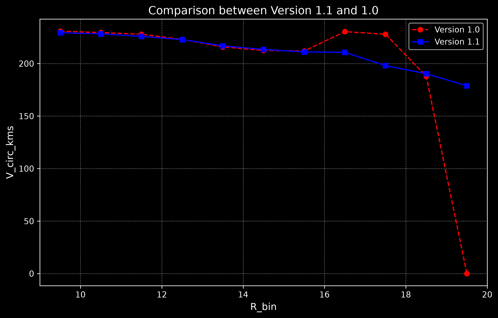
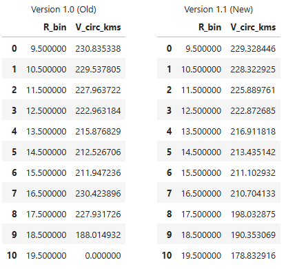

Version 1.1

# Milky Way Rotation Curve and Dark Matter Mass Modeling
Keywords: rotation curve, Milky Way, dark matter halo, Jeans equation,
red giant stars (RGB), velocity moments

## Current Status

!! The project is currently under development.

## Overview

The primary objective of this project is to calculating the **rotation curve**
and **total mass distribution** of the Milky Way by taking account dark matter 
halo. 

To achieve this, high-resolution spectroscopic data from **APOGEE DR17** and
astrometric measurements from **Gaia DR3** are used. **Red Giant Branch (RGB)**
stars are selected as traces of the galactic potential. 

The RGB's Earth-centered observational metrics (RA, DEC, distance, proper motions,
radial velocity) are transformed into a **Galactocentric coordinate system**,
then velocity moments and spatial dispersions values are calculated. 

The calculated velocity moments and spatial dispersions will be solved using 
the Jeans Equation to get the circular veloity of the Milky Way. To ensure 
precise alignment with modern literature, the Galactocentric reference frame 
parameters (such as the solar position and velocity) are calibrated
based on the work of Jiao et al. (2023). This analysis will determine the 
circular velocity profile at outer galactocentric radii, providing quantitative
constraints on the distribution of Dark Matter beyond the visible baryonic matter.
 
## Updates

The following detected errors have been addressed in *Version 1.1*:

(1) Code errors in Galactocentric frame creation and velocity calculation 

**File:** mw_dynamics/kinematics.py | **Title:** Calculation of the Galactocentric 3D Velocities of the Red Giant Stars 

(2) Showing a star under the same APOGEE_ID but different LOCATION_ID in the 
dataset table

**File:** mw_dynamics/selection.py | **Title:** Removing Duplicate Star Entries

(3) Missing values (NaN) in the radial_velocity column of the Gaia DR3 dataset

**File:** mw_dynamics/selection.py | **Title:** Filling Missing Gaia Radial Velocities

(4) Derivative calculations by switching from discrete point-to-point differentiation to a continuous function-based approach

**File:** Milky_Way_Mass_Rotation_Curve.ipynb | **Section:** 3.5, 3.6

(5) An error in the square root calculation logic.

**File:** Milky_Way_Mass_Rotation_Curve.ipynb | **Section:** 4

(6) Data filtering errors by properly accounting for measurement uncertainties (weighted_dist_error and radial_velocity_error) in Gaia DR3 and APOGEE DR17.

**File:** Milky_Way_Mass_Rotation_Curve.ipynb | **Section:** 1.2

With these fixes applied, the consistent results in the rotation curve have been
obtained: 

 

### Completed
- Gaia DR3 and APOGEE DR17 (SDSS) data downloading
- Selecting Red Giant stars (RGB) to analyze 
- Stellar velocity calculation
- Radial binning
- Velocity moments
- Jeans equation terms
- Preliminary Milky Way rotation curve

### In Progress
- Systematic uncertainty analysis

### Planned
- Comparison with additional literature rotation curves
- Multi-component mass modeling
- NFW dark matter halo fitting
- Halo mass estimation
- Model robustness tests
